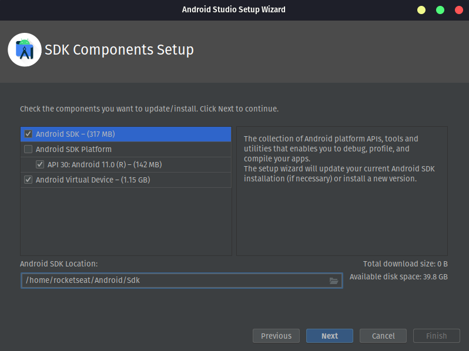
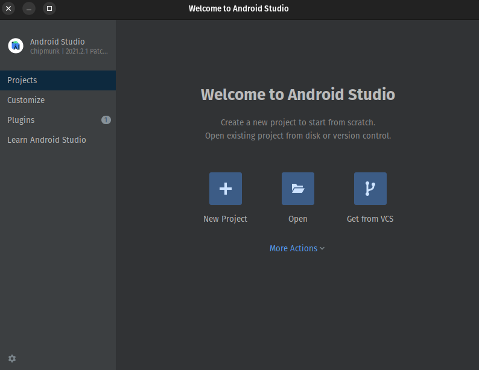

# Ignite - I'm Here

## React Native

Framework open source, Cross Platform(multiplataforma). Todo código desenvolvido é convertido para a linguagem nativa do sistema operacional. Conseguimos desenvolver aplicações para Android e iOS utilizando um código único.

> [Documentação](https://reactnative.dev).

## Expo & CLI

### Expo

O Expo é uma ferramenta bem abrangente que permite a criação de apps universais em React Native. E não apenas isso, ele tem um ecossistema bem interessante para a manutenção do seu app.

O objetivo é facilitar a configuração do seu app e também o acesso e instalação de vários frameworks que permitem o acesso a APIs nativas mais comuns.

Facilita (e muito) rodar seu projeto em dispositivos físicos. No seu ecossistema, o Expo, oferece um app para Android e para iOS que possibilita você rodar seu código no dispositivo. Isso mesmo, não precisa provisionar seu iPhone, só configurar certinho o app do Expo e rodar, mesmo de um sistema Linux ou Windows.

#### Managed workflow x Bare workflow


### CLI

Também chamado de Bare Workflow. É a forma nativa padrão de se criar um projeto em React Native. Ele também oferece alguns templates de projeto como Blank, TabBar ou outro customizado que queira utilizar.

O resultado da criação do projeto utilizando esta forma é bem enxuta. Tem o básico para funcionar e rodar.

O React Native pode ser atualizado a qualquer momento, inclusive versões alfa ou beta. Você pode tanto fazer um upgrade quanto um downgrade do core do React Native sem ter que esperar uma série de validações como no caso do Expo.

## Preparando o ambiente React Native - Linux

**Dependências**

Para configurar o ambiente Android e iOS no Linux (Ubuntu) utilizando `Expo Managed Workflow` (Expo GO), precisamos de 6 ferramentas principais:

- cURL
- Node.js (LTS);
- npm (já vem instalado com o Node);
- git
- expo-cli local
- Expo GO (app a ser instalado no dispositivo Android e/ou iOS)

Seguindo para configuração do ambiente Android no Linux utilizando Expo Bare Workflow ou `React Native CLI`, iremos realizar 2 instalações principais:

- JDK 11 (LTS);
- Android Studio e dependências.

### Instalando cURL

> O cURL pode já vir instalado. Para verificar, basta executar `curl --version` no terminal.

Para instalar no sistema, basta executar no terminal o comando abaixo:

```
sudo apt-get install curl
```

Para verificar se a instalação foi um sucesso, basta executar o comando abaixo:

```
curl --version
```

Se foi apresentado o valor da versão, a instalação foi um sucesso.

### Instalando Node.js (LTS) e npm

Em seguida é preciso instalar o **Node.js (LTS)** e **npm** no nosso sistema.

Para instalar, podemos utilizar um gerenciador de pacotes como o `n` ou instalar utilizando o NodeSource. Nesse guia iremos utilizar o `NodeSource`, então basta acessar abrir o terminal e executar os comandos abaixo:

```
curl -fsSL https://deb.nodesource.com/setup_16.x | sudo -E bash -
sudo apt-get install -y nodejs
```

> Se já tiver o Node.js instalado em sua máquina, certifique-se que sua versão é a 14 ou mais recente.

Para verificar se a instalação foi um sucesso, basta executar os comandos abaixo:

```
node -v
npm -v
```

### Git

> O git pode já vir instalado. Para verificar, basta executar `git --version` no seu terminal.

Para instalar no sistema, basta executar no seu terminal o comando abaixo:

```
sudo apt-get install git
```

Para verificar se a instalação foi um sucesso, basta executar o comando abaixo:

```
git --version
```

Se foi apresentado o valor da versão, a instalação foi um sucesso.

### JDK 11 (LTS)

> Se já tiver o JDK instalado em sua máquina, certifique-se que a versão seja exatamente a versão 11.

Agora precisamos instalar a JDK (Java Development Kit) na versão 11 (LTS) com o seguinte comando:

```
sudo add-apt-repository ppa:openjdk-r/ppa
sudo apt-get update
sudo apt-get install openjdk-11-jdk
```

Podemos testar a instalação do JDK executando o seguinte comando no terminal:

```
java -version
```

Caso apareça a versão do Java, a instalação foi um sucesso.

Se possuirmos outras versões do java, podemos selecionar a versão 11 como padrão usando o comando:

```
sudo update-alternatives --config java
```

## Android Studio

Vamos criar uma pasta em um local desejado para instalação da SDK. Ex: `~/Android/Sdk`.

> Anotar o caminho para ser utilizado posteriormente.

Vamos anotar também o endereço de instalação do JDK 11. Exemplo:

```
/usr/lib/jvm/java-11-openjdk-amd64
```

Caso não tenha certeza do caminho, busque na pasta /usr/lib/jvm/ pela pasta referente ao JDK 11, que provavelmente iniciará com java-11.

Com esses caminhos, precisamos configurar algumas variáveis ambiente em nosso sistema. Vamos procurar pelo primeiro dos seguintes arquivos existentes no seu sistema: `~/.zshrc` ou `~/.bashrc`, e adicionar essas seis linhas no arquivo (de preferência no início):

```
export JAVA_HOME=CAMINHO_ANOTADO_COM_SUA_VERSÃO
export ANDROID_HOME=~/Android/Sdk
export PATH=$PATH:$ANDROID_HOME/emulator
export PATH=$PATH:$ANDROID_HOME/tools
export PATH=$PATH:$ANDROID_HOME/tools/bin
export PATH=$PATH:$ANDROID_HOME/platform-tools
```

> Se nenhum desses arquivos existir, será necessário criar o `~/.bashrc` caso utilize o shell padrão (Bash) ou `~/.zshrc` caso utilize o ZSH.

> Não devemos nos esquecer de substituir o valor na linha **JAVA_HOME** pelo caminho que aotamos anteriormente. Além disso, caso estejamos utilizando uma pasta diferente para a SDK do Android, é necessário alterar acima.

### Instalação

Vamos acessar a página do [Android Studio](https://developer.android.com/studio) e clicar no botão **Download Android Studio**.

Vamos até pasta de download e abrir o arquivo `tar.gz`.

Esse arquivo deve possuir uma pasta `android-studio` dentro. Vamos extrair essa pasta em um local de preferência (Ex.: ~/).

Após a extração, vamos adicionar a seguinte variável ambiente no sistema:

```
export PATH=$PATH:~/android-studio/bin
```

> A adição desse caminho possibilita a execução do Android Studio diretamente pelo terminal com o comando `studio.sh`. Caso tenha extraído em uma pasta diferente ou alterado o nome da pasta, ajuste o path acima para o utilizado.

Agora, vamos abrir o terminal (reiniciar se já estiver aberto) e executar o seguinte comando:

```
studio.sh
```

### Configuração

A primeira janela a ser apresentada deve ser perguntando sobre a importação de configurações de outro Android Studio. Vamos selecionar a opção `Do not import settings` e clicar em `OK`.

Após o carregamento terminar, deve aparecer uma página de Welcome. Clicar em `Next`.

Na sequência, será pedido o tipo de instalação. Vamos escolher a opção `Custom` e clicar em `Next`.

Nesse momento, será pedido para escolher a localização do pacote JDK instalado. Clicar em `⬇` e verificar se a opção `JAVA_HOME` está apontando para a **JDK 11**. Se sim, vamos escolher e clicar em `Next`. Caso contrário, vamos clicar no no botão ... e escolher a JDK 11 (podemos inclusive utilizar o caminho anotado no passo anterior).


Em seguida, será perguntado sobre qual tema será utilizado. Vamos escolher o tema dracula e clicar em `Next`.

Chegamos na etapa mais importante do processo, a instalação da SDK. A janela apresentará algumas opções, marcaremos todas.



> `SDK` é o pacote que vai possibilitar que a aplicação React Native faça o build. Por padrão, ele instala a última SDK estável;
>
> O `Android Virtual Device` vai criar um emulador padrão pronto para execução.

Um fator essencial nessa etapa é o caminho de instalação da SDK. Utilizaremos a pasta que criamos a duas seções anteriores (Ex.: ~/Android/Sdk). Não utilizaremos espaços ou caracteres especiais, pois causará erros mais para frente.

Se tudo estiver correto, clicar em `Next`.

Na sequência, temos uma janela avisando sobre a possibilidade de executar o Emulador com melhor performance usando o KVM (Kernel-mode Virtual Machine). Essa etapa não irá aparecer para todos pois nem todo computador é compatível com esse recurso. Caso tenha interesse em instalar essa ferramenta, será ensinado como na próxima seção. Finalizada essa etapa, clicar em `Next`.

Em seguida, será apresentada uma janela com um resumo de todas as opções escolhidas até aqui. Verificando se estar tudo certo, clicar em `Finish`.

Por fim, será realizada a instalação das configurações selecionadas. Quando o programa terminar, clicar em `Finish`.

Caso a instalação e configuração do Android Studio ocorra com sucesso, devemos nos deparar com uma tela semelhante a essa:



### Emulador

Com o Android Studio, é possível configurar um emulador Android e executar a aplicação nele.

Porém, esses emuladores consomem bastante recursos do computador. Por isso, se possuir um dispositivo físico Android e a máquina utilizada possuir configurações modestas (ex.: ⬇ i3, ⬇ 4gb RAM), é recomendado executar a aplicação [**diretamente no dispositivo físico**](https://react-native.rocketseat.dev/physical-devices/usb/android).

Para aprender a configurar o seu emulador no Android Studio e executar a sua aplicação React Native nele, clique [**aqui**](https://react-native.rocketseat.dev/virtual-devices/android-emulator)

> Para iniciar um novo projeto com o React Native CLI, vamos utilizar o comando `npx react-native init myapp`.
>
> Podemos adicionar flags para especificar a linguagem, ex.: `npx react-native init myapp --template react-native-template-typescript`. 

## Estrutura de pastas

- **__tests__** : onde vamos conseguir rodar o nosso app e testar;
- **.bundle** : criamos um bundle para rodar no android, ele vai ser responsavel por transcrever o que está escrito no projeto para ser reconhecido no android;
- **android** : nessa pasta teremos as configurações nativas do android;
- **ios** : nessa pasta teremos as configurações nativas do ios;
- **node_modules** : pasta de dependências do javascript;
- **.buckconfig**, **.eslintrc**, **flowconfig** : arquivos de configurações;
- **prettierrc.js** : arquivo de regras de código;
- **.ruby-version** : para guardar a versão do ruby que vamos rodar no ios; 
- **.watchmanconfig** : arquivo de configuração de watch;
- **App.js** : arquivo da aplicação;
- **babel.config.js** : arquivo de configuração do babel, já vem configurado, faz compilação para as versões mais antigas do JS;
- **Gemfile**, **Gemfile.lock** : arquivos de gems para o ruby;
- **index.js** : porta de entrada da aplicação em react native, ele importa o _AppREgistry_ do react native, e usa o método _registerCompent_ que vai registrar o componente raíz da aplicação(Componente chamado App);
- **metro.config.js** : arquivo de configuração do metro bundle;
- **package.json** : arquivo de dependências JS;